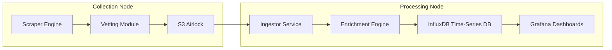

# README.md  
A high-level introduction to **Volkov**, an air-gapped Cyber Threat Intelligence (CTI) pipeline. It outlines the system’s goals, architecture, and component roles without diving into configuration details.  

## Overview  
Volkov leverages a **Store-and-Forward** design to isolate threat collection (The Ghost) from analysis (The Analyst). It aggregates data from Tor leak sites, Telegram channels, RSS/C2 feeds, and crimeware markets.  

## Architecture  
Three isolated zones prevent attribution and lateral movement.  
- **Ghost (Collection Node):** Disposable VPS scraping hostile sources.  
- **Airlock (Transport Layer):** S3-compatible dead-drop for one-way data flow.  
- **Analyst (Processing Node):** Secure enrichment, storage, and visualization.  



---

# docs/architecture.md  
Detailed network and trust boundary diagrams illustrating how data flows through the three zones. It explains segmentation, private networking, Tor routing, and firewall rules.  

---

# docs/deployment.md  
Step-by-step instructions to deploy both nodes and dashboards.  

- **Phase 1: Ghost Node**  
  1. Provision via Terraform (`infrastructure/`).  
  2. SSH into VPS, create `/app/.env` with Telegram and S3 credentials.  
  3. Launch Docker Compose stack (`docker-compose.ghost.yml`).  
  4. Perform interactive Telegram auth to generate session.  
  5. Enable system watchdog (auditd + Fail2Ban).  

- **Phase 2: Analyst Node**  
  1. Run `docker-compose.yml` in `analyst/` to start InfluxDB and Grafana.  
  2. Install Python deps for `ingestor.py` and `volkov_enrich.py`.  
  3. Run or systemd-manage the ingestion loop.  

- **Phase 3: Dashboards**  
  1. Access Grafana at `http://<ANALYST_IP>:3000`.  
  2. Configure InfluxDB Flux data source.  
  3. Import JSON dashboards from `analyst/dashboard/`.  

---

# docs/threat_model.md  
A formal threat model describing assumptions, trust boundaries, and mitigation strategies.  

- **Trust Zones:** Internet (Untrusted), Ghost VPS (Low), S3 Airlock (Medium), Analyst Node (High).  
- **Key Threats & Mitigations:**  
  - Attribution: All Tor traffic via SOCKS5.  
  - Lateral Movement: Strict air-gap, S3 write-only dead drop.  
  - Infrastructure Tampering: SSH‐key only, auditd file watches, Fail2Ban.  
  - Data Poisoning: Ingestor sanitizes and enforces strict typing.  

---

# infrastructure/main.tf  
Defines DigitalOcean provider, SSH key, and Ghost droplet provisioning.  
```hcl
provider "digitalocean" {
  token = var.do_token
}

resource "digitalocean_ssh_key" "volkov_key" {
  name       = "Volkov Ops Key"
  public_key = file(var.pvt_key_path)
}

resource "digitalocean_droplet" "ghost" {
  name               = "volkov-ghost-node-v1"
  image              = "debian-12-x64"
  region             = var.region
  size               = "s-1vcpu-1gb"
  ssh_keys           = [digitalocean_ssh_key.volkov_key.fingerprint]
  private_networking = true
  ipv6               = true
  monitoring         = true
  user_data          = file("user_data.sh")
  tags               = ["volkov","production","cti"]
}
```

---

# infrastructure/variables.tf  
Defines reusable variables for Terraform.  
```hcl
variable "do_token" {
  description = "DigitalOcean API token"
  type        = string
}

variable "pvt_key_path" {
  description = "Path to SSH public key"
  type        = string
}

variable "region" {
  description = "DO region (e.g., ams3)"
  type        = string
}
```

---

# infrastructure/terraform.tfvars.example  
Template to supply actual values.  
```hcl
do_token     = "dop_v1_your_token_here"
pvt_key_path = "../volkov_key.pub"
region       = "ams3"
```

---

# infrastructure/outputs.tf  
Exports key information post-deployment.  
```hcl
output "ghost_ip" {
  description = "Public IP of the Ghost Node"
  value       = digitalocean_droplet.ghost.ipv4_address
}

output "ssh_command" {
  description = "SSH command to connect"
  value       = "ssh -i ../volkov_key volkov_op@${digitalocean_droplet.ghost.ipv4_address}"
}
```

---

# infrastructure/user_data.sh  
Cloud-init script installing security tools, Docker, and launching the scraper stack.  

```bash
#!/bin/bash
export DEBIAN_FRONTEND=noninteractive
apt-get update && apt-get upgrade -y
apt-get install -y ufw fail2ban curl git python3-pip auditd
# Create operator user, migrate SSH keys, disable root login
useradd -m -s /bin/bash volkov_op
# … SSH hardening, UFW default deny incoming, install Docker
curl -fsSL https://get.docker.com | sh
systemctl enable docker
# Clone repo, launch Ghost Docker Compose
git clone https://github.com/… /app
cd /app
docker compose -f docker-compose.ghost.yml up -d --build
```

---

# ghost/Dockerfile  
Builds the Ghost container with Tor, Python deps, and rclone.  
```dockerfile
FROM python:3.11-slim-bookworm

RUN apt-get update && apt-get install -y \
    curl unzip smbclient \
  && rm -rf /var/lib/apt/lists/*

RUN curl https://rclone.org/install.sh | bash

WORKDIR /app
COPY requirements.txt .
RUN pip install --no-cache-dir -r requirements.txt

COPY scraper.py onion_lib.py vetter.py rss_lib.py c2_lib.py ./

RUN useradd -m volkov_op && chown -R volkov_op:volkov_op /app
USER volkov_op

CMD ["python", "-u", "scraper.py"]
```

---

# ghost/docker-compose.yml  
Defines the collection stack with the scraper and Tor sidecar.  

```yaml
version: '3.8'
services:
  ghost_scraper:
    build: .
    container_name: volkov_ghost
    restart: unless-stopped
    volumes:
      - ./volkov_data:/app/data
      - ./volkov_discovery_log.json:/app/volkov_discovery_log.json
      - ./volkov_session.session:/app/volkov_session.session
    environment:
      - TG_API_ID=${TG_API_ID}
      - TG_API_HASH=${TG_API_HASH}
      - TG_PHONE=${TG_PHONE}
      - S3_ENDPOINT=${S3_ENDPOINT}
      - S3_ACCESS_KEY=${S3_ACCESS_KEY}
      - S3_SECRET_KEY=${S3_SECRET_KEY}
      - S3_BUCKET=${S3_BUCKET}
      - TOR_PROXY_URL=socks5h://tor_proxy:9050
      - PYTHONUNBUFFERED=1

  tor_proxy:
    image: osminogin/tor-simple
    container_name: volkov_tor
    restart: always
    ports:
      - "127.0.0.1:9050:9050"
```

---

# ghost/requirements.txt  
Python dependencies for scraping and AWS integration.  
```
requests==2.31.0
PySocks==1.7.1
telethon==1.34.0
python-dotenv==1.0.1
boto3
beautifulsoup4
feedparser
```

---

# ghost/src/scraper.py  
An asynchronous loop that:  
- Performs **health checks** on targets (Telegram/Tor) and pushes JSON heartbeats.  
- Executes **low-frequency scrapes** of RSS, C2 feeds, Telegram channels, and `.onion` sites using a **Strategy Pattern**.  
- Dumps collected intel to local files and pushes them to the S3 Airlock.  
- Invokes the **vetter** module to identify high-value channels.  

### Key Components  
- `download_from_s3()` / `delete_from_s3()`: manage the S3 dead-drop.  
- `process_file()`: parse JSON payloads, construct InfluxDB points (health, tactical, market listings).  
- `main()` loop: orchestrates polling, file processing, archiving, and sleep intervals.  

---

# ghost/src/vetter.py  
Implements a **keyword-scoring** vetting mechanism to surface high-value targets.  

- Loads a **scoring matrix** of English and Russian crimeware keywords.  
- Scans recent Telegram messages for density of high-value terms.  
- Updates a `verified_targets.json` file with new leads when threshold is exceeded.  
- Can run standalone for manual testing or be invoked by the scraper.  

---

# analyst/docker-compose.yml  
Brings up the **InfluxDB v2** time-series database and **Grafana OSS** dashboard.  

```yaml
version: '3.8'
services:
  influxdb:
    image: influxdb:2
    container_name: volkov_db
    restart: unless-stopped
    ports:
      - "8086:8086"
    volumes:
      - influxdb_data:/var/lib/influxdb2
    environment:
      - DOCKER_INFLUXDB_INIT_MODE=setup
      - DOCKER_INFLUXDB_INIT_USERNAME=volkov_admin
      - DOCKER_INFLUXDB_INIT_PASSWORD=volkov_secret_password
      - DOCKER_INFLUXDB_INIT_ORG=volkov_intel
      - DOCKER_INFLUXDB_INIT_BUCKET=ransomware_tracker
      - DOCKER_INFLUXDB_INIT_ADMIN_TOKEN=my-super-secret-auth-token

  grafana:
    image: grafana/grafana-oss
    container_name: volkov_dashboard
    restart: unless-stopped
    ports:
      - "3000:3000"
    volumes:
      - grafana_data:/var/lib/grafana
    depends_on:
      - influxdb

volumes:
  influxdb_data:
  grafana_data:
```

---

# analyst/src/ingestor.py  
A polling service that retrieves JSON files from the Airlock, transforms them into InfluxDB points, and ingests them.  

1. **Configuration:** InfluxDB URL, tokens, S3 credentials, local paths.  
2. **S3 helpers:** `download_from_s3()`, `delete_from_s3()`.  
3. **`process_file()`:** Branches on data source (RSS, C2, Telegram/Tor market) and uses **volkov_enrich** for geolocation and attribution enrichment.  
4. **Main Loop:** Combines S3 and local files, processes each, archives successes, and sleeps between polls.  

```python
from influxdb_client import InfluxDBClient, Point
import boto3
import volkov_enrich

# Setup InfluxDB and S3 clients...
def process_file(filepath):
    data = json.load(open(filepath))
    for entry in data:
        # Build and tag Point objects based on entry['analysis']
        # ...
    write_api.write(bucket=BUCKET, org=ORG, record=points)
```

---

# analyst/src/volkov_enrich.py  
Performs **Just-in-Time** enrichment of raw observations:  

- **Geoint (Nominatim):** Maps victim names to lat/lon via OpenStreetMap.  
- **Wikidata HQ lookup:** Fallback to Wikidata API for corporate HQ coordinates.  
- **IPWhois:** Retrieves ASN, hosting provider, and country for C2 IPs.  
- **Caching & Sanitization:** Respects rate limits, cleans HTML entities, and caches results in memory.  

```python
from geopy.geocoders import Nominatim
from ipwhois import IPWhois

def clean_victim_name(name): ...
def get_wikidata_location(company_name): ...
def get_ip_context(ip_addr): ...
```

---

# analyst/dashboard/readme.md  
Instructions to import Grafana dashboards.  

- **Tactical Commander:** Real-time ransomware victims, attack vectors map, market listings.  
- **Russian CTI Dashboard:** APT tracking, C2 infrastructure, internal security alerts.  

```bash
1. Login to Grafana (http://localhost:3000)
2. Dashboards → New → Import
3. Upload JSON file from this directory
4. Select InfluxDB Flux data source
5. Click Import
```

---

# analyst/dashboard/global_cti_dashboard.json  
A JSON definition for the **Volkov CTI Commander** dashboard:  

- Multiple panels for live feeds, geomaps, health metrics, and market data.  
- Uses Flux queries against the `ransomware_tracker` bucket.  
- Template variables for selecting gangs, sectors, and regions.  
- Refresh interval set to 5 seconds for real-time monitoring.  

```jsonc
{
  "title": "Volkov CTI Commander",
  "panels": [
    {
      "type": "geomap",
      "title": "Attack Vectors",
      "targets": [
        {
          "query": "from(bucket:\"ransomware_tracker\") |> range(start:-1h) |>"
        }
      ]
    },
    // ...
  ],
  "templating": {
    "list": [
      { "name": "search_group", "type": "query", /* ... */ },
      { "name": "search_sector", "type": "query", /* ... */ }
    ]
  }
}
```

---

# analyst/dashboard/ru_cti_dashboard.json  
A specialized Russian-focused strategic dashboard:  

- **Row 1 (Russian APTs):** RSS-based strategic intel table.  
- **Row 2 (C2 Infrastructure):** Live map of active C2 servers.  
- **Row 3 (Internal Defense):** Auditd-driven security alerts on the Ghost node.  

Panels use influxdb Flux queries and value mappings (e.g., intrusion alerts colored in red).

---

# scripts/backfill_market.py  
A CLI tool to backfill **crimeware market listings** from saved Telegram dumps.  

1. Reads a JSON dump of market channel messages.  
2. Parses each message for listing type, category, and price.  
3. Packages parsed entries into a batch and uploads to the S3 Airlock under a backfill filename.  

```python
import boto3
def parse_market_message(text, channel):
    # NLP-lite parsing to classify listings
```

---

# scripts/dump_channel.py  
Dumps the last 100 messages (including hidden links) from specified Telegram channels for deep-dive analysis.  

- Uses **Telethon** to iterate messages.  
- Extracts text links and raw URLs via `MessageEntityTextUrl` and `MessageEntityUrl`.  
- Records forward origin metadata.  
- Saves output to a timestamped JSON file with ISO timestamps.  

---

# scripts/inject_simulation.py  
Simulates threat traffic by injecting synthetic JSON intel into the S3 Airlock.  

- Reads a local JSON template of simulated events.  
- Generates unique filenames and uploads to the S3 bucket.  
- Useful for testing the ingestion and dashboard pipeline.  

---

*This documentation guides new developers and researchers through each component’s purpose, configuration, and integration within the Volkov CTI pipeline.*